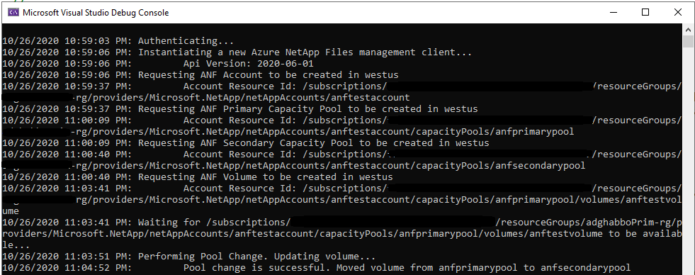

# Azure NetAppFiles SDK Sample - Pool Change for .NETCore 

This project demonstrates how to use a .NETCore sample application to perform a pool change on a Volume for the Microsoft.NetApp
resource provider. 

In this sample application we perform the following operations:

* Creations
    * ANF Account
    * Primary Capacity Pool in service level Premium
    * Secondary Capacity Pool in service level Standard
    * Volume in the Primary pool
* Updates
    * Perform pool change, moving Volume from Primary capacity pool to Secondary capacity pool 
* Deletions
    * Volume
    * Primary Capacity Pool
    * Secondary Capacity Pool
    * ANF Account

>Note: The cleanup execution is disabled by default. If you want to run this end to end with the cleanup, please
>change value of boolean variable 'shouldCleanup' in program.cs

If you don't already have a Microsoft Azure subscription, you can get a FREE trial account [here](http://go.microsoft.com/fwlink/?LinkId=330212). 

## Prerequisites

1. Azure Subscription
1. Subscription needs to be enabled for Azure NetApp Files. For more information, please refer to [this](https://docs.microsoft.com/azure/azure-netapp-files/azure-netapp-files-register#waitlist) document.
1. (Valid only while Pool Change feature is in preview state) Request preview access for Azure NetApp Files Pool Change. For more information, please refer to [this](https://docs.microsoft.com/en-us/azure/azure-netapp-files/dynamic-change-volume-service-level#register-the-feature) document.
1. Resource Group created
1. Virtual Network with a delegated subnet to Microsoft.Netapp/volumes resource. For more information, please refer to [Guidelines for Azure NetApp Files network planning](https://docs.microsoft.com/en-us/azure/azure-netapp-files/azure-netapp-files-network-topologies)
1. For this sample console appplication work, we are using service principal based  authenticate, follow these steps in order to setup authentication:
    1. Within an [Azure Cloud Shell](https://docs.microsoft.com/en-us/azure/cloud-shell/quickstart) session, make sure you're logged on at the subscription where you want to be associated with the service principal by default:
        ```bash
        az account show
        ```
        If this is not the correct subscription, use             
          ```bash
         az account set -s <subscription name or id>  
         ```
    1. Create a service principal using Azure CLI
        ```bash
        az ad sp create-for-rbac --sdk-auth
        ```

        >Note: this command will automatically assign RBAC contributor role to the service principal at subscription level, you can narrow down the scope to the specific resource group where your tests will create the resources.

    1. Copy the output content and paste it in a file called azureauth.json, secure it with file system permissions and save it outside the tree related of your 	local git repo folder so the file doesn't get commited. 
    1. Set an environment variable pointing to the file path you just created, here is an example with Powershell and bash:
        Powershell 
        ```powershell
       [Environment]::SetEnvironmentVariable("AZURE_AUTH_LOCATION", "C:\sdksample\azureauth.json", "User")
       ```
        Bash
        ```bash
        export AZURE_AUTH_LOCATION=/sdksamples/azureauth.json
        ``` 

        >Note: for more information on service principal authentication with dotnet, please refer to [Authenticate with the Azure Libraries for .NET](https://docs.microsoft.com/en-us/dotnet/azure/dotnet-sdk-azure-authenticate?view=azure-dotnet)

# What is netappfiles-dontnetcore-pool-change-sdk-sample doing? 

This sample is dedicated to demonstrating how to perform a pool change on a Volume in Azure NetApp Files.
Similar to other ANF SDK examples, the authentication method is based on a service principal.
This project will first create an ANF Account and then two Capacity Pools, one at a Premium service level tier, and another at a Standard service level tier.
Then it will create a single Volume in the Premium tier Capacity Pool.
Finally, the sample will perform the pool change operation on the Volume by moving it to the Standard tier Capacity Pool.

There is a section in the code dedicated to remove created resources. By default this sample will not remove all created resources;
this behavior is controlled by a boolean variable called 'shouldCleanup' in the program.cs class. If you want to erase all resources right after the
creation operations, set this variable to 'true'.

# How the project is structured

The following table describes all files within this solution:

| Folder      | FileName                | Description                                                                                                                         |
|-------------|-------------------------|-------------------------------------------------------------------------------------------------------------------------------------|
| Root        | program.cs              | Authenticates and executes all operations                                                                                           |
| Root		  | Creation.cs				| Performs the creation operations of resources																						  |
| Root 		  | Update.cs				| Performs the pool change operation																								  |
| Root 		  | Delete.cs 				| Performs the delete operations of the created resources																			  |
| Root\Common | ResourceUriUtils.cs     | Static class that exposes some methods that helps parsing Uris, building a new Uris or getting a resource name from Uri for example |
| Root\Common | ServicePrincipalAuth.cs | Small static class used when working with Service Principal based authentication                                                    |
| Root\Common | Utils.cs                | Static class that exposes a few methods that helps on various tasks, like writting a log to the console for example.                |
| Root\Model  | AzureAuthInfo.cs        | Class that defines an Azure AD Service Principal authentication file                                                                |

# How to run the console application

1. Clone it locally
    ```powershell
    git clone https://github.com/Azure-Samples/netappfiles-dotnetcore-pool-change-sdk-sample.git
    ```
1. Make sure you change the variables located at **.netappfiles-dotnetcore-pool-change-sdk-sample\src\anf_dotnetcore_pool_change_sdk_sample\program.cs at RunAsync method.**
1. Change folder to **.netappfiles-dotnetcore-pool-change-sdk-sample\src\anf_dotnetcore_pool_change_sdk_sample**
1. Since we're using service principal authentication flow, make sure you have the **azureauth.json** and its environment variable with the path to it defined (as previously described)
1. Build the console application
    ```powershell
    dotnet build
    ```
1. Run the console application
    ```powershell
    dotnet run
    ```

Sample output


# References

* [Azure NetAppFiles SDK Sample for .NETCore - More advanced example](https://docs.microsoft.com/en-us/samples/azure-samples/netappfiles-dotnetcore-sdk-sample/azure-netappfiles-sdk-sample-for-netcore/)
* [Authenticate with the Azure Libraries for .NET](https://docs.microsoft.com/en-us/dotnet/azure/dotnet-sdk-azure-authenticate?view=azure-dotnet)
* [Resource limits for Azure NetApp Files](https://docs.microsoft.com/en-us/azure/azure-netapp-files/azure-netapp-files-resource-limits)
* [Azure Cloud Shell](https://docs.microsoft.com/en-us/azure/cloud-shell/quickstart)
* [Azure NetApp Files documentation](https://docs.microsoft.com/en-us/azure/azure-netapp-files/)
* [Download Azure SDKs](https://azure.microsoft.com/downloads/)
 
